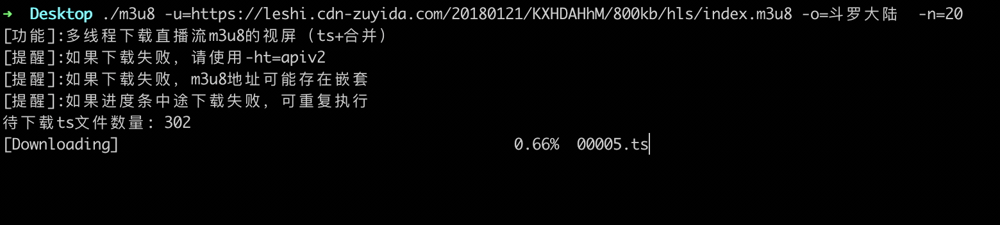

# m3u8-downloader

golang 多线程下载直播流m3u8格式的视屏，跨平台。 你只需指定必要的 flag (`u`、`o`、`n`、`ht`) 来运行, 工具就会自动帮你解析 M3U8 文件，并将 TS 片段下载下来合并成一个文件。


## 功能介绍

1. 下载和解析 M3U8
2. 下载 TS 失败重试 （加密的同步解密)
3. 合并 TS 片段

> 可以下载岛国小电影  
> 可以下载岛国小电影  
> 可以下载岛国小电影    
> 重要的事情说三遍......

## 效果展示


## 参数说明：

```
- u  m3u8下载地址(http(s)://url/xx/xx/index.m3u8)
- o  movieName:自定义文件名(默认为movie)不带后缀 (default "movie")
- n  num:下载线程数(默认24)
- ht hostType:设置getHost的方式(v1: http(s):// + url.Host + filepath.Dir(url.Path); v2: `http(s)://+ u.Host` (default "v1")
- c  cookie:自定义请求cookie (例如：key1=v1; key2=v2)
- r  autoClear:是否自动清除ts文件 (default true)
- s  InsecureSkipVerify:是否允许不安全的请求(默认0)
- sp savePath:文件保存的绝对路径(默认为当前路径,建议默认值)(例如：unix:/Users/xxxx ; windows:C:\Documents)
```

默认情况只需要传`u`参数,其他参数保持默认即可。 部分链接可能限制请求频率，可根据实际情况调整 `n` 参数的值。

## 下载

已经编译好的平台有： [点击下载](https://github.com/llychao/m3u8-downloader/releases)

- windows/amd64
- linux/amd64
- darwin/amd64

## 用法

### 源码方式

```bash
自己编译：go build -o m3u8-downloader
简洁使用：./m3u8-downloader  -u=http://example.com/index.m3u8
完整使用：./m3u8-downloader  -u=http://example.com/index.m3u8 -o=example -n=16 -ht=v1 -c="key1=v1; key2=v2"
```

### 二进制方式:

Linux 和 MacOS 和 Windows PowerShell

```
简洁使用：
./m3u8-linux-amd64 -u=http://example.com/index.m3u8
./m3u8-darwin-amd64 -u=http://example.com/index.m3u8 
.\m3u8-windows-amd64.exe -u=http://example.com/index.m3u8

完整使用：
./m3u8-linux-amd64 -u=http://example.com/index.m3u8 -o=example -n=16 -ht=v1 -c="key1=v1; key2=v2"
./m3u8-darwin-amd64 -u=http://example.com/index.m3u8 -o=example -n=16 -ht=v1 -c="key1=v1; key2=v2"
.\m3u8-windows-amd64.exe -u=http://example.com/index.m3u8 -o=example -n=16 -ht=v1 -c="key1=v1; key2=v2"
```

## 问题说明

1.在Linux或者mac平台，如果显示无运行权限，请用chmod 命令进行添加权限
```bash
 # Linux amd64平台
 chmod 0755 m3u8-linux-amd64
 # Mac darwin amd64平台
 chmod 0755 m3u8-darwin-amd64
 ```
2.下载失败的情况,请设置 -ht="apiv1" 或者 -ht="apiv2" （默认为apiv1）
```golang
func get_host(Url string, ht string) string {
    u, err := url.Parse(Url)
    var host string
    checkErr(err)
    switch ht {
    case "v1":
        host = u.Scheme + "://" + u.Host + path.Dir(u.Path)
    case "v2":
        host = u.Scheme + "://" + u.Host
    }
    return host
}
```
